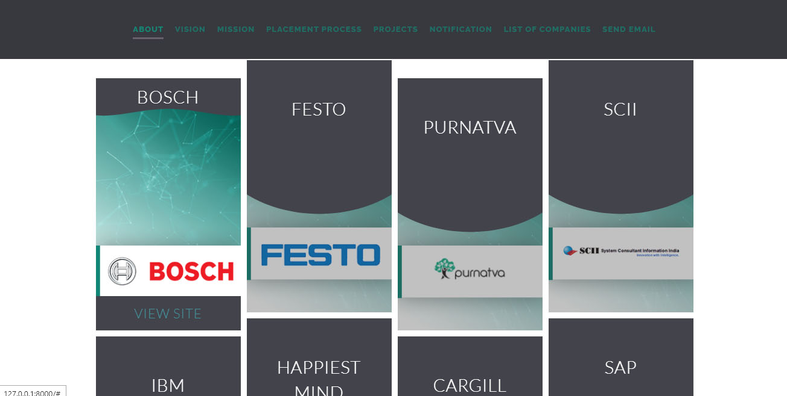
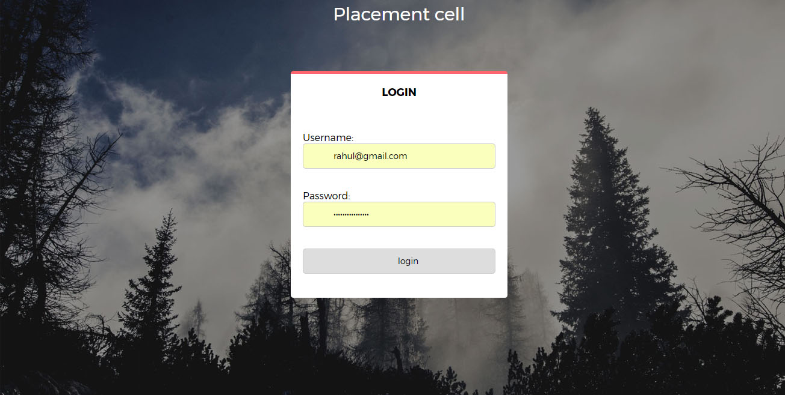
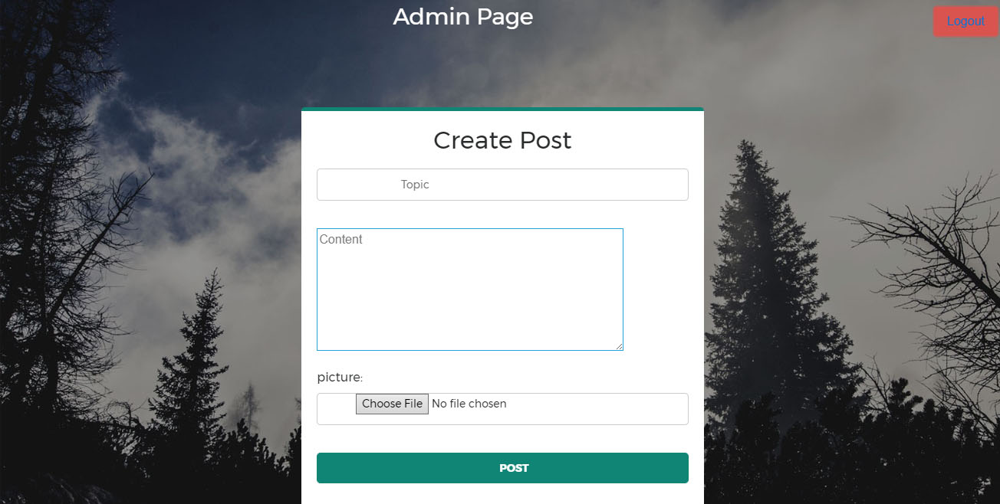
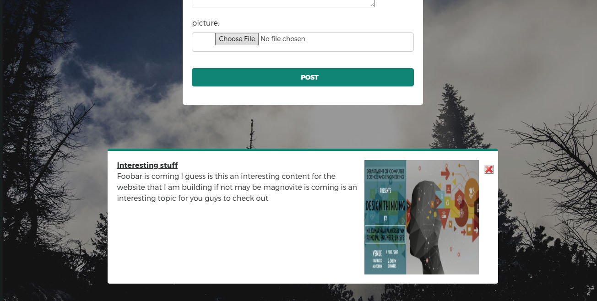

# Placement cell Website

  

<h2>Requirements:</h2>
<ul><li>Django(python)</li>
<li>HTML, CSS, JAVAScript</li>
<li>BootStrap</li>
</ul>
<h2>Description:</h2>
  This is a simple website developed for our university placement activities.
  It includes:
  <ul><li>Admin Console: for monitoring previously uploaded informations, and to update new notifications</li>
  <li>Notification: Where the Page admin can dynamically upload placement related information</li>
  <li>Login Screen</li></ul>
  

    Main Page(Notification) 
  
    Main Page(Companies List) 
  
    Login screen 
  
    Admin Panel 
  
    Admin Panel2 
  

<h3>Developers</h3>
<ul><li>Rahul B George</li>
  <li>Arnold Gabriel Benedict</li></ul>
